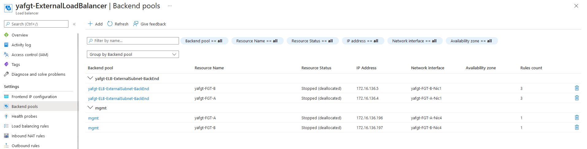
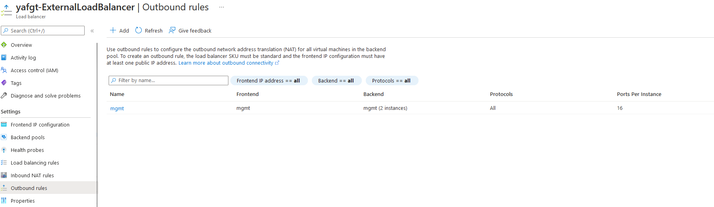

# Management Connection

There are different ways to access your FGT Vms.We can define here two approaches: 

1. Instance level public ip: This is the default. 
2. Private IP via VPN, ExpressRoute, jumphost (Azure Bastion, …)


## Is instance level public IP required on FGT mgmt port?

We still need to have Public IP attached to instance For azure SDN connector to resolve dynamic objects and communications with fortiguard for licesnsing and firmware update.

Fortinet Communication Ports and Protocols [here](https://docs.fortinet.com/document/fortigate/7.2.0/fortios-ports/160067/outgoing-ports). 


## How to secure the mgmt interface?

### Instance level Public IP with NSG

### Extra IP and rules via Public Load Balancer

You can remove public IPs from management interfaces and keep only Private IP on mgmt port4 for both FGTs. 
You will be able to reach FGTs using additional Public IP attached to external load balancer following these steps:

 - Add additional management public IP to Frontend IP configuration in ELB.

<p align="center">
  
</p>

- Create management pool and add mgmt NICs for both FGTs to ELB backend pools.

<p align="center">
  
</p>

- Add outbound rule with new Public IP and mgmt pool.

<p align="center">
  
</p>

### Proxy configuration
FGT-Vm will be able to access internet only via web proxy. 
This can be done in the similar way for configuration web proxy to inject flex vm license.

You can find [here](https://docs.fortinet.com/document/flex-vm/1.0.0/deployment-guide/256339/injecting-flex-vm-license-via-web-proxy#Confirmi) more dtails.

Microsoft provides access control lists (ACL) on Azure networking attaching to a subnet or a network interface of a virtual machine. Debugging is possible by writing logs to a Storage Account or Azure Log Analytics. More information can be found [here](https://docs.microsoft.com/en-us/azure/virtual-network/virtual-network-nsg-manage-log)

Below you can see an output in JSON of a log rule as they can be found on the storage account:

```
{
  "records": [
    {
      "time": "2020-08-03T07:18:43.2317151Z",
      "systemId": "ca0eb670-63ac-4f05-9d82-7c01addd59f3",
      "macAddress": "000D3ABEB097",
      "category": "NetworkSecurityGroupFlowEvent",
      "resourceId": "/SUBSCRIPTIONS/F7F4728A-781F-470F-B029-BAC8A9DF75AF/RESOURCEGROUPS/JVHAZS-RG/PROVIDERS/MICROSOFT.NETWORK/NETWORKSECURITYGROUPS/JVHAZS-HOST1-NSG",
      "operationName": "NetworkSecurityGroupFlowEvents",
      "properties": {
        "Version": 2,
        "flows": [
          {
            "rule": "DefaultRule_DenyAllInBound",
            "flows": [
              {
                "mac": "000D3ABEB097",
                "flowTuples": [
                  "1596439087,94.102.51.77,10.0.0.4,58501,8121,T,I,D,B,,,,",
                  "1596439097,194.26.29.143,10.0.0.4,53411,32457,T,I,D,B,,,,",
                  "1596439102,87.251.74.200,10.0.0.4,44755,8213,T,I,D,B,,,,",
                  "1596439103,45.129.33.8,10.0.0.4,51401,9849,T,I,D,B,,,,"
                ]
              }
            ]
          }
        ]
      }
    }
  ]
}

```
## Standard Public IP

The standard public ip has some extra features like zone redundancy. The most important item property of this Standard SKU resource is that inbound communication fails until an network security group is associated with the network interface or subnet that allows the inbound traffic.

More information can be found [here](https://docs.microsoft.com/en-us/azure/virtual-network/public-ip-addresses#standard)

## FortiGate

On the FortiGate there is a plethora of troubleshooting tools available. More can be found [here](https://docs2.fortinet.com/document/fortigate/6.4.3/administration-guide/244292/troubleshooting).

For your deployment in Azure there are some specific

- Accelerated Networking: This enables direct connection from the VM to the backend ethernet hardware on the hypervisor and enables much better throughput.
  - On the FortiGate you can retrieve the network interface configuration. The SR-IOV pseudo interace should only be available when accelerated networking is activated. On the driver side the driver called 'hv_netvsc' needs to be active. If the speed lists 40000full or 50000full the accelerated networking driver is active. The FortiOS GUI does not display the virtual interface.
  - On the Azure Portal it can be verified on the network interface properties pane. Alternatively this information can be requested via the Azure CLI.

```
<VM name> # fnsysctl ifconfig
port1 Link encap:Ethernet HWaddr 00:0D:3A:B4:87:70
inet addr:172.29.0.4 Bcast:172.29.0.255 Mask:255.255.255.0
UP BROADCAST RUNNING MULTICAST MTU:1500 Metric:1
RX packets:5689 errors:0 dropped:0 overruns:0 frame:0
TX packets:0 errors:0 dropped:0 overruns:0 carrier:0
collisions:0 txqueuelen:1000
RX bytes:1548978 (1.5 MB) TX bytes:0 (0 Bytes)
sriovslv0 Link encap:Ethernet HWaddr 00:0D:3A:B4:87:70
UP BROADCAST RUNNING SLAVE MULTICAST MTU:1500 Metric:1
RX packets:35007 errors:0 dropped:0 overruns:0 frame:0
TX packets:33674 errors:0 dropped:0 overruns:0 carrier:0
collisions:0 txqueuelen:1000
RX bytes:34705194 (33.1 MB) TX bytes:10303956 (9.8 MB)
```

```
<VM name> # diagnose hardware deviceinfo nic port1
Name: port1
Driver: hv_netvsc
...
Speed:           40000full
```
or
```
<VM name> # diagnose hardware deviceinfo nic port1
Name: port1
Driver: hv_netvsc
...
Speed:           50000full
```

Azure CLI NIC information
```
# az network nic show -g <Resource group name> -n <NIC name>
```

- Fabric connector: This connector enables integration with the Azure platform. More troubleshooting can be found [here](https://docs.fortinet.com/vm/azure/fortigate/7.0/azure-administration-guide/7.0.0/985498/troubleshooting-azure-fabric-connector)
