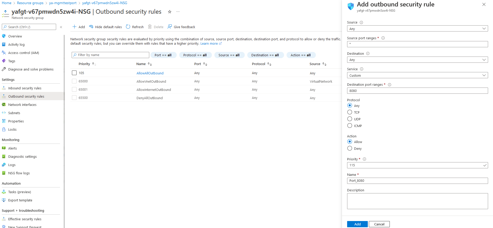

# Management Connection

There are different ways to access your FGT Vms. We can define here two approaches: 

1. Instance level public IP: FGT-VM is reachable through PIP attached to managemnt port. This is the default method.  
2. Private IP via VPN, ExpressRoute, jumphost (Azure Bastion, …)

## Is instance level public IP required on FGT mgmt port?

FGT needs to have public IP related to mgmt port for azure SDN connector to resolve dynamic objects and to have communications with fortiguard for licesnsing and firmware update. 

Fortinet Communication Ports and Protocols [here](https://docs.fortinet.com/document/fortigate/7.2.0/fortios-ports/160067/outgoing-ports). 

## How to secure the mgmt interface?

Security can be done on mgmt port with one of the following approaches:

### -Instance level Public IP with NSG

FGT have public IP directly associated to mgmt Port.
Inbound/outbound rules can be created within NSG associated to mgmt NIC. You can define on each rule src/dest type, port and action.
Rules are processed in priority order; The lower the number, the highest the priority.

  

### -Extra IP and rules via Public Load Balancer

You can remove public IPs from management interfaces and keep only Private IP on mgmt port4 for both FGTs. 
You will be able to reach FGTs using additional Public IP attached to external load balancer following these steps:

 - Add additional management public IP to Frontend IP configuration in ELB.

  

- Create management pool and add mgmt NICs for both FGTs to ELB backend pools.

  

- Add outbound rule with new Public IP and mgmt pool.

  

### -Proxy configuration
FGT-Vm will be able to access internet only via web proxy. 
This can be done in the similar way for configuration web proxy to inject flex vm license.

You can find [here](https://docs.fortinet.com/document/flex-vm/1.0.0/deployment-guide/256339/injecting-flex-vm-license-via-web-proxy#Confirmi) more dtails.

